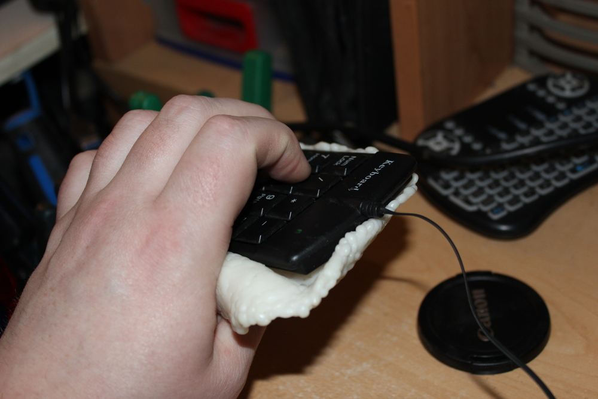

# qPad
one handed USB number pad chording keyboard. 

might work good for coding while you are sleeping.

initial keyboard mapping (untested fully but it looks and feels nice)
3=k
6=a
9=h
8=t
5=e
2=h
4=d
1=o
0=g
0+000=b
1+2=s
4+5=p
.=u
+=z
enter=enter
2+3=x
000+.=w
5+6=y

8+9=r
7=q
4+1=m
3+6=d
2+5=f
3+.=C

shift=

0+1+4=I
0+1+5=L

7+8=backspace
*+-=.
*+/=,
7=q
8+9=r

update
9=j 000=i 3=s 1+2=v 5+6=k  1+4 =n

whole bottom row singles will be space bar

todo features
add audio for key pressing
gui features
loadable mappings
key delay when holding

keymap for brainfu*k programming 2 rows of 4 keys
keymap for blender

